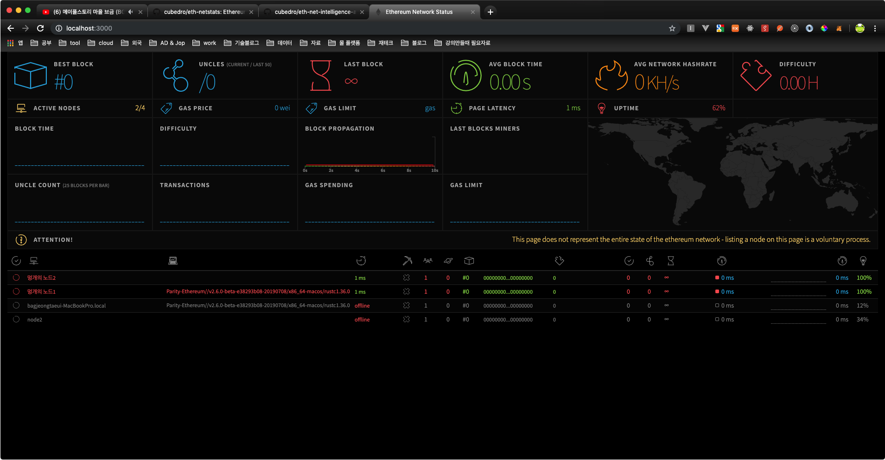

# Ethereum BlockChain System By Parity

parity 기반의 private network 구축

1. **Directory Structure**

```
.
├── README.md
├── eth-net-intelligence-api
├── eth-netstats
├── node1
│   ├── chain.json
│   ├── node.pwds
│   ├── node.toml
│   ├── nodes
│   ├── parity.log
│   ├── parity_pid_check.sh
│   └── start.sh
└── node2
    ├── DATA_STORE
    ├── chain.json
    ├── node.pwds
    ├── node.toml
    ├── nodes
    ├── parity.log
    ├── parity_pid_check.sh
    └── start.sh
```

## 2. start



### 2.1. 방법 1

* node1 실행

```bash
$ cd node1
$ ./start.sh
```

* node2 실행

```bash
$ cd node2
$ ./start.sh
```

* 모니터링 render 서버 실행

```bash
$ cd eth-netstats
$ grunt
$ WS_SECRET=hello_world npm start
```

* 모니터링 agent1 서버 실행

```bash
$ eth-net-intelligence-api1
$ WS_SECRET=hello_world INSTANCE_NAME="멍개의 노드1" npm start
```

* 모니터링 agent2 서버 실행

```bash
$ eth-net-intelligence-api2
$ WS_SECRET=hello_world RPC_PORT=8546 LISTENING_PORT=30304 INSTANCE_NAME="멍개의 노드2" npm start
```

### 2.2. 방법 2

각 agent 서버의 processed-ex2.json을 이용하여 agent 서버와 ethereum node 실행관리

* 모니터링 render 서버 실행

```bash
$ cd eth-netstats
$ grunt
$ WS_SECRET=hello_world npm start
```

* node1의 agent 서버와 노드 실행

```bash
$ cd eth-net-intelligence-api1

```

**`processes-ec2.json`**

```json
[
  {
    "name"              : "eth1",
    "cwd"               : "../node1",
    "script"            : "start.sh",
    "args"              : "ethpassword",
    "log_date_format"   : "YYYY-MM-DD HH:mm Z",
    "log_file"          : "./logs/eth-log.log",
    "out_file"          : "./logs/eth-out.log",
    "error_file"        : "./logs/eth-err.log",
    "merge_logs"        : false,
    "watch"             : false,
    "max_restarts"      : 10,
    "exec_interpreter"  : "bash",
    "exec_mode"         : "fork_mode"
  },
  {
    "name"              : "node-app1",
    "cwd"               : "./",
    "script"            : "app.js",
    "log_date_format"   : "YYYY-MM-DD HH:mm Z",
    "log_file"          : "./logs/node-app-log.log",
    "out_file"          : "./logs/node-app-out.log",
    "error_file"        : "./logs/node-app-err.log",
    "merge_logs"        : false,
    "watch"             : false,
    "max_restarts"      : 10,
    "exec_interpreter"  : "node",
    "exec_mode"         : "fork_mode",
    "env":
    {
      "NODE_ENV"        : "production",
      "RPC_HOST"        : "localhost",
      "RPC_PORT"        : "8545",
      "LISTENING_PORT"  : "30303",
      "INSTANCE_NAME"   : "멍개님의 노드1",
      "CONTACT_DETAILS" : "",
      "WS_SERVER"       : "127.0.0.1:3000",
      "WS_SECRET"       : "hello_world",
      "VERBOSITY"       : 2
    }
  }
]

```

```bash
$ pm2 start processes-es2.json
```

* node2의 agent 서버와 노드 실행

```bash
$ cd eth-net-intelligence-api2
```

**`processes-ec2.json`**

```json5
[
  {
    "name"              : "eth2",
    "cwd"               : "../node2",
    "script"            : "start.sh",
    "args"              : "ethpassword",
    "log_date_format"   : "YYYY-MM-DD HH:mm Z",
    "log_file"          : "./logs/eth-log.log",
    "out_file"          : "./logs/eth-out.log",
    "error_file"        : "./logs/eth-err.log",
    "merge_logs"        : false,
    "watch"             : false,
    "max_restarts"      : 10,
    "exec_interpreter"  : "bash",
    "exec_mode"         : "fork_mode"
  },
  {
    "name"              : "node-app2",
    "cwd"               : "./",
    "script"            : "app.js",
    "log_date_format"   : "YYYY-MM-DD HH:mm Z",
    "log_file"          : "./logs/node-app-log.log",
    "out_file"          : "./logs/node-app-out.log",
    "error_file"        : "./logs/node-app-err.log",
    "merge_logs"        : false,
    "watch"             : false,
    "max_restarts"      : 10,
    "exec_interpreter"  : "node",
    "exec_mode"         : "fork_mode",
    "env":
    {
      "NODE_ENV"        : "production",
      "RPC_HOST"        : "localhost",
      "RPC_PORT"        : "8546",
      "LISTENING_PORT"  : "30304",
      "INSTANCE_NAME"   : "멍개님의 노드2",
      "CONTACT_DETAILS" : "",
      "WS_SERVER"       : "127.0.0.1:3000",
      "WS_SECRET"       : "hello_world",
      "VERBOSITY"       : 2
    }
  }
]

```

```bash
$ pm2 start processes-es2.json
```

